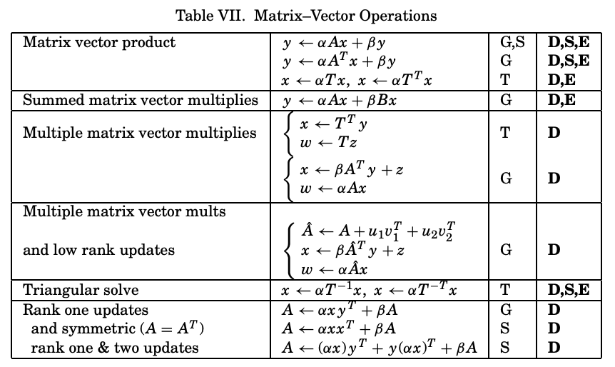
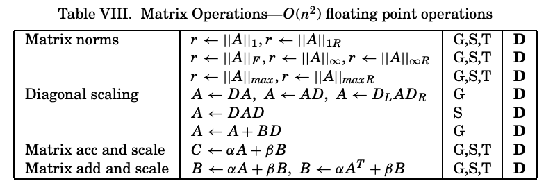
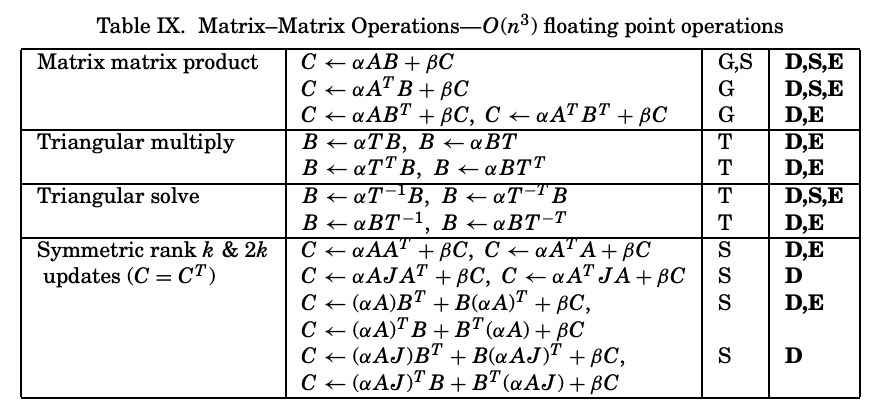
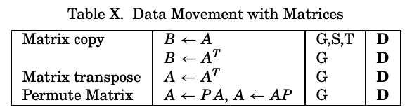

# BLAS on SME

## BLAS Matrix Operations

Source: [Blackford et al., “An Updated Set of Basic Linear Algebra Subprograms (BLAS)][3]

### Matrix–Vector Operations

---

### Matrix Operations—O(n²) Floating-Point Ops

---

###  Matrix–Matrix Operations—O(n³) Floating-Point Ops

---

### Data Movement with Matrices

---

G = General, S = Symmetric (or Hermitian), T = Triangular.  
D = Double Precision, S = Single Precision, E = Extended and Mixed Precision

<!-- ---

### Fine-grain ops that *lack* single-instruction support

| Gap                                | Today’s sequence (≥)               |
| ---------------------------------- | ---------------------------------- |
| **(a) Tile × scalar**              | broadcast α → loop FMUL per row    |
| **(b) Tile transpose**             | extract col → insert row, 16 ×     |
| **(c) Element-wise f(x)**          | vector op on each row              |
| **(d) Reduce tile (sum/max)**      | multi-vector reduce → horiz-reduce |
| **(e) Diagonal get/set**           | loop 16 gathers / stores           |
| **(f) Clear upper/lower triangle** | row-wise masked zero stores        |
| **(g) Complex GEMM**               | 4 × `FMOPA` + adds/subs            |
| **(h) Row/col permutation**        | pairwise row/col swaps             | -->

---

## SME Instruction Wishlist

| Gap                            | Today’s Workaround                                                                   | Proposed Instruction                                                              | BLAS Kernels                                                                                                                                                                                                                                                   |
| ------------------------------ | ------------------------------------------------------------------------------------ | --------------------------------------------------------------------------------- | -------------------------------------------------------------------------------------------------------------------------------------------------------------------------------------------------------------------------------------------------------------- |
| **Tile × Scalar**              | Broadcast scalar → extract rows to vectors → FMUL every row → move rows back to tile | Multiply every element of a ZA tile by a scalar                                   | General Matrix–Matrix Multiply (GEMM); Symmetric/Hermitian Rank-k & Rank-2k Updates (SYRK/HERK, SYR2K/HER2K); Rank-1/2 Updates (GER/GER2); Triangular Matrix Multiply (TRMM); Triangular Solve with Multiple RHS (TRSM); General Matrix–Vector Multiply (GEMV) |
| **Tile Load/ Store**           | Load rows to vector → move to tile                                                   | Load/ store the entire tile                                                       | Matrix Copy/Transpose data-movement ops                                                                                                                                                                                                                        |
| **Elementwise Functions**      | Extract rows to vectors → Apply vector op to each row → move rows back to tile       | Apply sqrt, exp, etc. to all tile elements at once                                | ML kernels that interleave BLAS tiles with element-wise activations                                                                                                                                                                                            |
| **Reduce Tile**                | Extract rows to vectors → elemetwise vector reduce → horizontal reduce               | Collapse an entire tile to a single sum or max value                              | Matrix-norm and “max element” kernels                                                                                                                                                                                                                          |
| **Diagonal Get/ Set**          | Extract rows to vectors → Loop of  gathers/stores                                    | Extract the diagonal to one vector or insert a vector as the diagonal in one step | Triangular Solve (TRSM, TRSV); Diagonal Scaling; Rank-1/2 symmetric updates; LU & Cholesky factorizations                                                                                                                                                      |
| **Clear Upper/Lower Triangle** | Row-wise masked zero stores                                                          | Zero the upper or lower half of a tile in one go                                  | Symmetric/Hermitian Rank-k & Rank-2k Updates (SYRK/HERK, SYR2K/HER2K); triangular preparation in TRMM/TRSM                                                                                                                                                     |
| **Row/ Col Permutation**       | Pair-wise swaps of rows/columns                                                      | Permute rows or columns of a tile according to an index vector in one step        | Matrix Permutation (A ← P A or A ← A P); pivoting inside LU/QR factorizations                                                                                                                                                                                  |

---

### References

* **Arm v9-A SME ISA:** *Arm Architecture Reference Manual. ([ARM Developer][1])
* **BLAS spec:** Netlib BLAS site & BLAS Technical Forum standard – definitions for Level 1/2/3 kernels. ([netlib.org][2], [tsapps.nist.gov][3])

---

[1]: https://developer.arm.com/documentation/ddi0487/latest/ "Documentation – Arm Developer"
[2]: https://www.netlib.org/blas/ "BLAS (Basic Linear Algebra Subprograms)"
[3]: https://tsapps.nist.gov/publication/get_pdf.cfm?pub_id=50982&utm_source=chatgpt.com "[PDF] An Updated Set of Basic Linear Algebra Subprograms (BLAS)"
[4]: https://scalable.uni-jena.de/opt/sme/gemm.html?utm_source=chatgpt.com "GEMM | Hello SME documentation"
